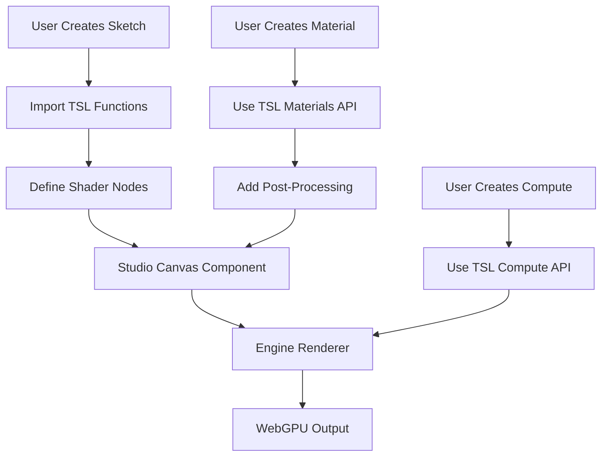

# 🏗️ TSLStudio Architecture Restructuring Proposal

> **Goal:** Create a unified, coherent architecture with clear separation of concerns and a streamlined development pipeline

## 📊 Current State Analysis

### Problems Identified

1. **🔀 Duplication & Confusion**
   - Two root folders: `/engine` and `/src` with overlapping functionality
   - Materials exist in both `/engine/materials` and `/src/tsl/materials`
   - Post-processing in both `/engine/fx` and `/src/tsl/post_processing`
   - Compute shaders in both `/engine/compute` and `/src/tsl/compute`

2. **🎯 Unclear Boundaries**
   - No clear distinction between "engine" code and "application" code
   - Mixed concerns: rendering engine + UI components + TSL utilities
   - Ambiguous import paths: `@engine` vs `@/tsl`

3. **📁 Poor Discoverability**
   - Hard to know where to add new features
   - Inconsistent naming conventions (`fx` vs `post_processing`)
   - No clear pipeline or workflow

4. **🔧 Maintainability Issues**
   - Changes require updates in multiple locations
   - Risk of feature drift between duplicated modules
   - Difficult to reason about dependencies

---

## 🎨 Proposed Architecture

### Core Principles

1. **Single Source of Truth** - No duplication
2. **Clear Layering** - Engine → TSL → App → UI
3. **Consistent Naming** - Uniform terminology across codebase
4. **Explicit Dependencies** - Clear import hierarchy
5. **Scalability** - Easy to extend and maintain

---

## 🗂️ New Structure

```
TSLStudio/
├── 📦 packages/                    # Monorepo-style organization
│   ├── engine/                     # Core WebGPU rendering engine
│   │   ├── core/                   # Renderer, pipeline, framegraph
│   │   │   ├── renderer.ts
│   │   │   ├── framegraph.ts
│   │   │   ├── pipeline.ts
│   │   │   └── inspector.ts
│   │   ├── assets/                 # Asset management
│   │   │   ├── loader.ts
│   │   │   ├── cache.ts
│   │   │   └── types.ts
│   │   ├── scene/                  # Scene management
│   │   │   ├── scene.ts
│   │   │   ├── node.ts
│   │   │   └── camera.ts
│   │   └── index.ts
│   │
│   ├── tsl/                        # Three.js Shading Language library
│   │   ├── materials/              # Material systems
│   │   │   ├── pbr/
│   │   │   │   ├── standard.ts
│   │   │   │   ├── anisotropy.ts
│   │   │   │   ├── clearcoat.ts
│   │   │   │   ├── sheen.ts
│   │   │   │   ├── transmission.ts
│   │   │   │   └── iridescent.ts
│   │   │   ├── stylized/
│   │   │   │   ├── matcap.ts
│   │   │   │   └── triplanar.ts
│   │   │   └── index.ts
│   │   │
│   │   ├── compute/                # GPU compute shaders
│   │   │   ├── particles/
│   │   │   │   ├── emitter.ts
│   │   │   │   ├── forces.ts
│   │   │   │   └── renderer.ts
│   │   │   ├── simulation/
│   │   │   │   ├── fluid2d.ts
│   │   │   │   ├── curl-noise.ts
│   │   │   │   └── sdf.ts
│   │   │   └── index.ts
│   │   │
│   │   ├── post/                   # Post-processing effects
│   │   │   ├── core/
│   │   │   │   ├── composer.ts
│   │   │   │   ├── pass.ts
│   │   │   │   └── chain.ts
│   │   │   ├── effects/
│   │   │   │   ├── bloom.ts
│   │   │   │   ├── dof.ts
│   │   │   │   ├── taa.ts
│   │   │   │   ├── chromatic-aberration.ts
│   │   │   │   ├── color-grading.ts
│   │   │   │   ├── film-grain.ts
│   │   │   │   ├── vignette.ts
│   │   │   │   ├── lcd-effect.ts
│   │   │   │   ├── canvas-weave.ts
│   │   │   │   ├── pixellation.ts
│   │   │   │   └── speckled-noise.ts
│   │   │   └── index.ts
│   │   │
│   │   ├── noise/                  # Noise functions
│   │   │   ├── simplex-3d.ts
│   │   │   ├── simplex-4d.ts
│   │   │   ├── perlin-3d.ts
│   │   │   ├── curl-3d.ts
│   │   │   ├── curl-4d.ts
│   │   │   ├── fbm.ts
│   │   │   ├── turbulence.ts
│   │   │   └── index.ts
│   │   │
│   │   ├── utils/                  # TSL utility functions
│   │   │   ├── color/
│   │   │   │   ├── cosine-palette.ts
│   │   │   │   ├── tonemapping.ts
│   │   │   │   └── index.ts
│   │   │   ├── math/
│   │   │   │   ├── complex.ts
│   │   │   │   ├── coordinates.ts
│   │   │   │   └── index.ts
│   │   │   ├── sdf/
│   │   │   │   ├── shapes.ts
│   │   │   │   ├── operations.ts
│   │   │   │   └── index.ts
│   │   │   ├── function/
│   │   │   │   ├── bloom.ts
│   │   │   │   ├── bloom-edge-pattern.ts
│   │   │   │   ├── domain-index.ts
│   │   │   │   ├── median3.ts
│   │   │   │   ├── repeating-pattern.ts
│   │   │   │   └── screen-aspect-uv.ts
│   │   │   ├── lighting.ts
│   │   │   └── index.ts
│   │   │
│   │   └── index.ts
│   │
│   └── studio/                     # Studio application layer
│       ├── components/             # React components
│       │   ├── canvas/
│       │   │   ├── webgpu-scene.tsx
│       │   │   ├── webgpu-sketch.tsx
│       │   │   ├── color-space-correction.tsx
│       │   │   └── index.ts
│       │   ├── ui/
│       │   │   ├── sketches-dropdown/
│       │   │   ├── debug-panel/
│       │   │   └── index.ts
│       │   ├── layout/
│       │   │   ├── main-layout.tsx
│       │   │   └── index.ts
│       │   └── index.ts
│       │
│       ├── demos/                  # Pre-built demos
│       │   ├── pbr-showcase/
│       │   │   ├── scene.ts
│       │   │   ├── canvas.tsx
│       │   │   └── index.ts
│       │   ├── particles/
│       │   │   ├── scene.ts
│       │   │   ├── canvas.tsx
│       │   │   └── index.ts
│       │   └── index.ts
│       │
│       ├── sketches/               # User sketches
│       │   ├── examples/
│       │   │   ├── dawn-1.ts
│       │   │   └── flare-1.ts
│       │   └── README.md
│       │
│       ├── routes/                 # TanStack Router
│       │   ├── __root.tsx
│       │   ├── index.tsx
│       │   ├── sketches.$.tsx
│       │   └── demos.$demoId.tsx
│       │
│       ├── utils/                  # App utilities
│       │   ├── cn.ts
│       │   ├── math.ts
│       │   ├── error-boundary.tsx
│       │   └── index.ts
│       │
│       └── index.ts
│
├── 📝 docs/                        # Documentation
│   ├── architecture/
│   │   ├── overview.md
│   │   ├── engine-layer.md
│   │   ├── tsl-layer.md
│   │   └── studio-layer.md
│   ├── guides/
│   │   ├── getting-started.md
│   │   ├── creating-sketches.md
│   │   ├── custom-materials.md
│   │   └── post-processing.md
│   └── api/
│       ├── engine.md
│       ├── tsl.md
│       └── studio.md
│
├── 🧪 examples/                    # Example projects
│   ├── basic-sketch/
│   ├── custom-material/
│   └── compute-particles/
│
├── 🔧 config/                      # Configuration
│   ├── vite.config.ts
│   ├── tsconfig.base.json
│   ├── tsconfig.engine.json
│   ├── tsconfig.tsl.json
│   └── tsconfig.studio.json
│
├── 📦 public/                      # Static assets
├── 📜 index.html
├── 📋 package.json
└── 📖 README.md
```

---

## 🎯 Layer Definitions

### 1️⃣ Engine Layer (`packages/engine/`)
**Purpose:** Low-level WebGPU rendering infrastructure

- **Responsibilities:**
  - WebGPU renderer management
  - Render pipeline orchestration
  - Frame graph execution
  - Asset loading and caching
  - Scene graph management
  - Performance profiling

- **Dependencies:** `three/webgpu` only
- **No dependencies on:** TSL layer or Studio layer

### 2️⃣ TSL Layer (`packages/tsl/`)
**Purpose:** Reusable Three.js Shading Language components

- **Responsibilities:**
  - Material definitions (PBR, stylized)
  - Compute shader programs
  - Post-processing effects
  - Noise functions
  - Shader utilities

- **Dependencies:** `three/tsl`, Engine layer
- **No dependencies on:** Studio layer (React)

### 3️⃣ Studio Layer (`packages/studio/`)
**Purpose:** Interactive web application

- **Responsibilities:**
  - React UI components
  - Sketch management
  - Demo scenes
  - Routing
  - User interactions

- **Dependencies:** Engine, TSL, React, React Three Fiber

---

## 🔄 Unified Pipeline

### Development Workflow



### Import Hierarchy

```typescript
// ✅ Correct: Studio imports from TSL
import { bloom, taa } from '@tsl/post'
import { createRenderer } from '@engine/core'

// ✅ Correct: TSL imports from Engine
import { RendererHandle } from '@engine/core'

// ❌ Wrong: Engine imports from TSL
import { bloom } from '@tsl/post' // NO!

// ❌ Wrong: TSL imports from Studio
import { WebGPUScene } from '@studio/components' // NO!
```

---

## 🚀 Migration Plan

### Phase 1: Consolidation (Week 1)
1. **Merge Duplicate Code**
   - Merge `/engine/materials` + `/src/tsl/materials` → `/packages/tsl/materials`
   - Merge `/engine/fx` + `/src/tsl/post_processing` → `/packages/tsl/post`
   - Merge `/engine/compute` + `/src/tsl/compute` → `/packages/tsl/compute`

2. **Establish Package Structure**
   - Create `/packages` directory
   - Move `/engine/core` → `/packages/engine/core`
   - Move `/src/tsl` → `/packages/tsl`
   - Move `/src/components`, `/src/routes` → `/packages/studio`

### Phase 2: Clean Separation (Week 2)
1. **Update Dependencies**
   - Ensure Engine has zero dependencies on TSL/Studio
   - Ensure TSL has zero dependencies on Studio
   - Update all import paths

2. **Configure Build System**
   - Create workspace TypeScript configs
   - Update Vite config for new structure
   - Set up path aliases

### Phase 3: Documentation (Week 3)
1. **Write Architecture Docs**
   - Layer responsibilities
   - API documentation
   - Migration guide

2. **Create Examples**
   - Basic sketch example
   - Custom material example
   - Compute shader example

### Phase 4: Testing & Refinement (Week 4)
1. **Validate Structure**
   - Test all imports work
   - Verify build output
   - Check bundle sizes

2. **Developer Experience**
   - Ensure clear error messages
   - Add helpful comments
   - Create templates

---

## 📋 File Naming Conventions

### Standardized Naming

```typescript
// ✅ Use kebab-case for files
screen-aspect-uv.ts
chromatic-aberration.ts
curl-noise-3d.ts

// ✅ Use PascalCase for React components
WebGPUScene.tsx
SketchesDropdown.tsx
MainLayout.tsx

// ✅ Use camelCase for utilities
cosinePalette.ts
domainIndex.ts

// ✅ Consistent terminology
post/         (not fx/ or post_processing/)
materials/    (everywhere)
compute/      (everywhere)
```

---

## 🔧 Updated TypeScript Configuration

### Root Config (`tsconfig.json`)

```json
{
  "compilerOptions": {
    "baseUrl": ".",
    "paths": {
      "@engine/*": ["./packages/engine/*"],
      "@tsl/*": ["./packages/tsl/*"],
      "@studio/*": ["./packages/studio/*"]
    },
    "target": "ES2022",
    "module": "ESNext",
    "jsx": "react-jsx",
    "strict": true
  },
  "references": [
    { "path": "./packages/engine" },
    { "path": "./packages/tsl" },
    { "path": "./packages/studio" }
  ]
}
```

### Engine Config (`packages/engine/tsconfig.json`)

```json
{
  "extends": "../../config/tsconfig.base.json",
  "compilerOptions": {
    "rootDir": ".",
    "outDir": "../../dist/engine"
  },
  "include": ["**/*.ts"]
}
```

---

## 🎨 Updated Vite Configuration

```typescript
import { defineConfig } from 'vite'
import react from '@vitejs/plugin-react'
import glsl from 'vite-plugin-glsl'
import path from 'path'
import { TanStackRouterVite } from '@tanstack/router-vite-plugin'

export default defineConfig({
  plugins: [react(), glsl(), TanStackRouterVite()],
  resolve: {
    alias: {
      '@engine': path.resolve(__dirname, 'packages/engine'),
      '@tsl': path.resolve(__dirname, 'packages/tsl'),
      '@studio': path.resolve(__dirname, 'packages/studio'),
    },
  },
  optimizeDeps: {
    esbuildOptions: {
      target: 'esnext',
    },
  },
  build: {
    target: 'esnext',
  },
})
```

---

## 📊 Benefits of New Architecture

### ✅ Immediate Benefits
- **No more confusion** about where code belongs
- **No more duplication** - single source of truth
- **Clear imports** - obvious hierarchy
- **Better organization** - logical grouping

### 🚀 Long-term Benefits
- **Scalability** - easy to add new features
- **Maintainability** - clear dependencies
- **Testability** - isolated layers
- **Reusability** - packages can be extracted
- **Onboarding** - new devs understand structure quickly

### 📦 Future Possibilities
- Extract `@engine` as standalone npm package
- Extract `@tsl` as standalone npm package
- Monorepo with Turborepo/Nx for better DX
- Separate deployments per package

---

## 🛠️ Implementation Checklist

### Pre-Migration
- [ ] Backup current codebase
- [ ] Document current import dependencies
- [ ] Identify all duplicated code
- [ ] Create migration branch

### Migration
- [ ] Create `/packages` structure
- [ ] Move Engine code
- [ ] Move TSL code (merge duplicates)
- [ ] Move Studio code
- [ ] Update all imports
- [ ] Update build configs
- [ ] Update package.json scripts

### Post-Migration
- [ ] Test all routes work
- [ ] Test all sketches load
- [ ] Test all demos function
- [ ] Verify build output
- [ ] Update README
- [ ] Write migration notes

### Documentation
- [ ] Architecture overview
- [ ] Layer documentation
- [ ] API reference
- [ ] Migration guide
- [ ] Examples

---

## 🤝 Team Considerations

### Communication
- Share proposal with team
- Gather feedback
- Address concerns
- Plan migration timeline

### Training
- Document new structure
- Create video walkthrough
- Pair programming sessions
- Code review guidelines

---

## 📚 References & Inspiration

- **Monorepo Best Practices** - Turborepo, Nx
- **Three.js Architecture** - Clear layer separation
- **React Three Fiber** - Component organization
- **Vue.js Core** - Package structure
- **Clean Architecture** - Robert C. Martin

---

## 🎯 Success Metrics

### Quantitative
- ⬇️ 50% reduction in duplicate code
- ⬆️ 100% clearer import paths
- ⬇️ 30% faster onboarding time
- ⬆️ Better bundle optimization

### Qualitative
- Developers know exactly where to add code
- No ambiguity in file locations
- Easier to reason about dependencies
- Better developer experience

---

## 🔮 Future Enhancements

### Phase 5+: Advanced Features
1. **Package Extraction**
   - Publish `@tslstudio/engine` to npm
   - Publish `@tslstudio/tsl` to npm

2. **Developer Tools**
   - VSCode extension for TSL
   - Shader hot-reloading
   - Visual node editor

3. **Performance**
   - Code splitting per package
   - Lazy loading demos
   - Optimized bundle sizes

---

## 💡 Conclusion

This restructuring will transform TSLStudio from a confusing dual-folder structure into a **clear, scalable, and maintainable architecture**. The new three-layer system (Engine → TSL → Studio) provides:

- ✨ **Clarity** - Obvious where everything belongs
- 🚀 **Scalability** - Easy to extend
- 🔧 **Maintainability** - Clear dependencies
- 📦 **Reusability** - Extractable packages
- 😊 **Developer Joy** - Better DX

**Estimated Migration Time:** 3-4 weeks  
**Risk Level:** Medium (mitigated by thorough testing)  
**Impact:** High (foundational improvement)

---

**Next Steps:**
1. Review and approve proposal
2. Create detailed migration tasks
3. Begin Phase 1 consolidation
4. Iterate based on feedback

---

*Document Version: 1.0*  
*Created: November 4, 2025*  
*Author: AI Assistant*

