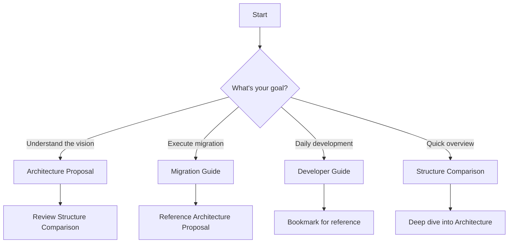

# 📚 TSLStudio Documentation

> Comprehensive documentation for the TSLStudio architecture restructuring

## 📋 Overview

This documentation suite covers the complete architectural redesign of TSLStudio, transforming it from a confusing dual-folder structure into a clean, unified, and scalable architecture.

---

## 📑 Documents

### 1. 🏗️ [Architecture Proposal](./ARCHITECTURE_PROPOSAL.md)
**Purpose:** Complete architectural redesign proposal  
**Audience:** Technical leads, architects, stakeholders  
**Contents:**
- Current state analysis
- Proposed structure with detailed breakdown
- Layer definitions (Engine → TSL → Studio)
- Unified pipeline design
- Migration plan (4-phase approach)
- Benefits analysis
- Success metrics

**Read this first if you want to:**
- Understand the "why" behind the restructuring
- See the complete new architecture
- Review the migration strategy
- Present to stakeholders

---

### 2. 🔄 [Migration Guide](./MIGRATION_GUIDE.md)
**Purpose:** Step-by-step migration instructions  
**Audience:** Developers executing the migration  
**Contents:**
- Pre-migration checklist
- Detailed migration steps (12 days)
- Phase-by-phase instructions
- Import path updates
- Configuration changes
- Testing strategy
- Rollback plan
- Common issues & solutions

**Read this if you want to:**
- Execute the migration
- Understand the technical steps
- Know what to do at each phase
- Handle migration issues

---

### 3. 📊 [Structure Comparison](./STRUCTURE_COMPARISON.md)
**Purpose:** Visual before/after comparison  
**Audience:** All team members  
**Contents:**
- Current structure with problems highlighted
- Proposed structure with solutions
- Side-by-side comparisons
- Import path evolution
- Decision-making clarity
- Metrics comparison
- Onboarding experience improvement

**Read this if you want to:**
- Quickly understand the differences
- See visual representations
- Understand specific problems being solved
- Present to non-technical stakeholders

---

### 4. 👨‍💻 [Developer Guide](./DEVELOPER_GUIDE.md)
**Purpose:** Quick reference for daily development  
**Audience:** All developers  
**Contents:**
- Package reference (@engine, @tsl, @studio)
- Common tasks (add material, effect, demo, sketch)
- File naming conventions
- Best practices
- Debugging tips
- Performance tips
- Checklists

**Read this if you want to:**
- Know where to add new code
- Understand import patterns
- Follow best practices
- Find code quickly
- Debug issues

---

## 🎯 Quick Navigation

### By Role

#### 👔 **I'm a Tech Lead / Architect**
1. Read: [Architecture Proposal](./ARCHITECTURE_PROPOSAL.md)
2. Review: [Structure Comparison](./STRUCTURE_COMPARISON.md)
3. Plan: Use migration timeline from Architecture Proposal

#### 🛠️ **I'm Implementing the Migration**
1. Read: [Architecture Proposal](./ARCHITECTURE_PROPOSAL.md) (understand the goal)
2. Follow: [Migration Guide](./MIGRATION_GUIDE.md) (execute step-by-step)
3. Reference: [Structure Comparison](./STRUCTURE_COMPARISON.md) (when confused)

#### 💻 **I'm a Developer (post-migration)**
1. Read: [Developer Guide](./DEVELOPER_GUIDE.md) (daily reference)
2. Skim: [Structure Comparison](./STRUCTURE_COMPARISON.md) (understand reasoning)

#### 📊 **I'm a Stakeholder / PM**
1. Read: [Structure Comparison](./STRUCTURE_COMPARISON.md) (visual overview)
2. Review: Benefits section in [Architecture Proposal](./ARCHITECTURE_PROPOSAL.md)

---

### By Task

#### 🤔 **I need to understand the current problems**
→ Read [Structure Comparison](./STRUCTURE_COMPARISON.md) - "Current Structure (Problems)" section

#### 🏗️ **I need to see the proposed solution**
→ Read [Architecture Proposal](./ARCHITECTURE_PROPOSAL.md) - "Proposed Architecture" section

#### 🔨 **I need to execute the migration**
→ Follow [Migration Guide](./MIGRATION_GUIDE.md) step-by-step

#### 📝 **I need to write code in the new structure**
→ Use [Developer Guide](./DEVELOPER_GUIDE.md) as reference

#### 🐛 **I'm debugging an issue**
→ Check [Developer Guide](./DEVELOPER_GUIDE.md) - "Debugging" section

#### 📈 **I need to present to stakeholders**
→ Use [Architecture Proposal](./ARCHITECTURE_PROPOSAL.md) + [Structure Comparison](./STRUCTURE_COMPARISON.md)

---

## 🚀 Getting Started

### For First-Time Readers

**Start here:**



### Reading Order

#### 📖 **Comprehensive Understanding (2-3 hours)**
1. [Architecture Proposal](./ARCHITECTURE_PROPOSAL.md) - 45 mins
2. [Structure Comparison](./STRUCTURE_COMPARISON.md) - 30 mins
3. [Migration Guide](./MIGRATION_GUIDE.md) - 60 mins
4. [Developer Guide](./DEVELOPER_GUIDE.md) - 30 mins

#### ⚡ **Quick Overview (30 mins)**
1. [Structure Comparison](./STRUCTURE_COMPARISON.md) - 20 mins
2. [Architecture Proposal](./ARCHITECTURE_PROPOSAL.md) - Summary sections - 10 mins

#### 🎯 **Task-Focused (as needed)**
- Migration: [Migration Guide](./MIGRATION_GUIDE.md)
- Development: [Developer Guide](./DEVELOPER_GUIDE.md)

---

## 📊 Document Statistics

| Document | Length | Read Time | Detail Level |
|----------|--------|-----------|--------------|
| Architecture Proposal | ~1200 lines | 45 mins | Comprehensive |
| Migration Guide | ~800 lines | 60 mins | Detailed |
| Structure Comparison | ~600 lines | 30 mins | Visual |
| Developer Guide | ~600 lines | 30 mins | Reference |

---

## 🎨 Key Concepts

### The Three Layers

```
┌─────────────────────────────────────┐
│  Layer 3: Studio (@studio)          │
│  React app, UI, demos, sketches     │
├─────────────────────────────────────┤
│  Layer 2: TSL (@tsl)                │
│  Shaders, materials, effects        │
├─────────────────────────────────────┤
│  Layer 1: Engine (@engine)          │
│  WebGPU rendering infrastructure    │
└─────────────────────────────────────┘

Dependencies flow downward only ↓
```

### The Main Change

```
Before:
  engine/       ← Confused: Low-level + high-level mixed
  src/          ← Confused: App + library mixed
  
After:
  packages/
    engine/     ← Clear: Pure rendering engine
    tsl/        ← Clear: Shader library
    studio/     ← Clear: React application
```

### Import Philosophy

```typescript
// Clear, predictable, hierarchical
import { createRenderer } from '@engine/core'      // Layer 1
import { bloom } from '@tsl/post/effects'         // Layer 2
import { WebGPUScene } from '@studio/components'   // Layer 3
```

---

## 💡 Quick Reference

### Where Does Code Go?

| Type of Code | Location |
|--------------|----------|
| WebGPU renderer | `@engine/core` |
| PBR material | `@tsl/materials/pbr` |
| Stylized material | `@tsl/materials/stylized` |
| Post effect | `@tsl/post/effects` |
| Compute shader | `@tsl/compute` |
| Noise function | `@tsl/noise` |
| Shader utility | `@tsl/utils` |
| React component | `@studio/components` |
| Demo scene | `@studio/demos` |
| User sketch | `@studio/sketches` |
| Route | `@studio/routes` |
| App utility | `@studio/utils` |

### Import Patterns

```typescript
// Engine
import { createRenderer } from '@engine/core'

// TSL - Materials
import { standard, iridescent } from '@tsl/materials/pbr'
import { matcap } from '@tsl/materials/stylized'

// TSL - Post
import { bloom, taa, dof } from '@tsl/post/effects'

// TSL - Compute
import { ParticleEmitter } from '@tsl/compute/particles'

// TSL - Noise
import { simplexNoise3d } from '@tsl/noise'

// TSL - Utils
import { screenAspectUV } from '@tsl/utils/function'

// Studio
import { WebGPUScene } from '@studio/components/canvas'
import { PBRShowcase } from '@studio/demos/pbr-showcase'
```

---

## 🔍 Searching the Docs

### By Keyword

- **"duplicate"** → Structure Comparison, Architecture Proposal
- **"import"** → Developer Guide, Migration Guide
- **"layer"** → Architecture Proposal, Developer Guide
- **"migration"** → Migration Guide, Architecture Proposal
- **"material"** → Developer Guide, Migration Guide
- **"post-processing"** → Developer Guide, Migration Guide
- **"TSL"** → All documents
- **"engine"** → All documents
- **"studio"** → All documents
- **"package"** → Architecture Proposal, Developer Guide

### By Section

**Problems:**
- Structure Comparison → "Current Structure (Problems)"
- Architecture Proposal → "Current State Analysis"

**Solutions:**
- Structure Comparison → "Proposed Structure (Solutions)"
- Architecture Proposal → "Proposed Architecture"

**How-to:**
- Developer Guide → "Common Tasks"
- Migration Guide → "Detailed Migration Steps"

**Reference:**
- Developer Guide → "Package Reference"
- Migration Guide → "Import Path Updates"

---

## 📖 Glossary

| Term | Definition |
|------|------------|
| **Engine** | Layer 1: Low-level WebGPU rendering infrastructure |
| **TSL** | Three.js Shading Language - Layer 2: Shader library |
| **Studio** | Layer 3: React application layer |
| **Package** | One of the three main folders: engine, tsl, or studio |
| **Layer** | Architectural level with defined dependencies |
| **Sketch** | User-created TSL shader program |
| **Demo** | Pre-built showcase scene |
| **Effect** | Post-processing visual effect |
| **Material** | Surface rendering definition |
| **Compute** | GPU compute shader program |

---

## 🛠️ Contributing to Docs

### Adding New Documentation

1. **Determine purpose** - What problem does it solve?
2. **Identify audience** - Who will read it?
3. **Choose format** - Tutorial? Reference? Guide?
4. **Write content** - Follow existing style
5. **Update this README** - Add to navigation

### Documentation Standards

- **Use emojis** for visual navigation
- **Include code examples** for technical content
- **Add diagrams** where helpful
- **Keep table of contents** updated
- **Cross-reference** related documents
- **Use consistent terminology** (see Glossary)

---

## 📅 Changelog

| Date | Change | Document |
|------|--------|----------|
| 2025-11-04 | Initial creation | All documents |
| 2025-11-04 | Added README | This file |

---

## 🤝 Feedback

### Questions?

If you have questions about:
- **Architecture** → Review Architecture Proposal
- **Implementation** → Check Migration Guide
- **Daily development** → See Developer Guide
- **Still unclear?** → Open a discussion with the team

### Suggestions?

Improvements welcome! Please:
1. Identify which document needs updating
2. Suggest specific changes
3. Explain the benefit

---

## 🎯 Success Indicators

Documentation is successful when:
- ✅ New developers understand structure quickly
- ✅ Migration executes smoothly
- ✅ Developers know where to add code
- ✅ Import patterns are consistent
- ✅ Questions are answered by docs

---

## 🚀 Next Steps

### Before Migration
1. ✅ Review [Architecture Proposal](./ARCHITECTURE_PROPOSAL.md)
2. ✅ Get team buy-in
3. ✅ Plan timeline

### During Migration
1. 📋 Follow [Migration Guide](./MIGRATION_GUIDE.md)
2. 📊 Track progress
3. 🐛 Document issues

### After Migration
1. 📖 Bookmark [Developer Guide](./DEVELOPER_GUIDE.md)
2. 📝 Update docs as needed
3. 🎓 Share knowledge

---

## 📞 Support

- **Technical questions:** Reference Developer Guide
- **Migration issues:** Check Migration Guide
- **Architecture questions:** Review Architecture Proposal
- **Quick help:** See Structure Comparison

---

**Happy reading! 📚✨**

*These docs are living documents - update them as the project evolves.*

---

**Created:** November 4, 2025  
**Last Updated:** November 4, 2025  
**Version:** 1.0  
**Status:** ✅ Complete

