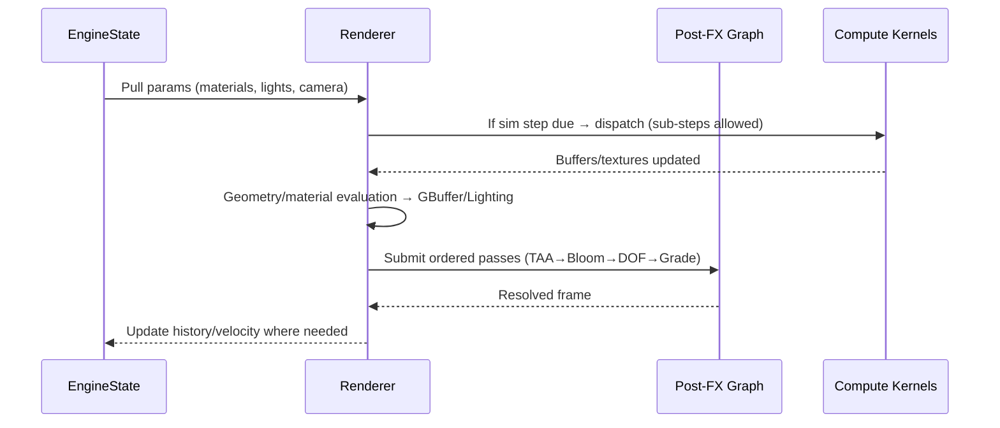

# TSL Toolkit Engine — Deep Specification (v1)

> **Scope:** A self‑contained, plug‑and‑play, agent‑addressable graphics toolkit layered over a modern WebGPU/Node‑style paradigm. This spec defines goals, principles, architecture, behaviors, and quality bars for the engine only (separate from the website shell).

---

## 1) Mission & Non‑Goals

**Mission**
- Deliver **cinematic, physically credible** rendering and **GPU‑native** simulation with a **small, stable API** that humans and AI agents can drive.
- Favor **determinism, ergonomic authoring,** and **temporal stability** over raw “benchmark wins.”

**Non‑Goals**
- Not a full DCC (no heavy scene editing, rigging, or sculpting).
- Not a monolith: avoids bundling content management or site routing.

---

## 2) Design Principles

1. **Canvas‑first core** — Always on, hot‑swappable states.
2. **Expressive defaults** — Beautiful without tweaking; deep control when needed.
3. **Deterministic creativity** — Seeds + reproducible snapshots.
4. **Temporal stability** — TAA history discipline; velocity buffers; pass ordering.
5. **Small surface, strong names** — Stable param registry; humane namespaces.
6. **Agent‑safe** — Types, ranges, clamps, and undo for every public param.
7. **Performance with taste** — Adaptive res/LODs and budgets that preserve look.

---

## 3) High‑Level Architecture

```mermaid
flowchart TB
  subgraph EngineCore[Engine Core]
    Scene[Scene Graph]
    Mat[Material/TSL Node Graph]
    Compute[Compute Layer\n(buffers,textures,kernels)]
    PostFX[Post‑FX Framegraph]
    Camera[Physical Camera + Time]
  end
  subgraph State[State & Presets]
    SSOT[EngineState\n(SSOT)]
    Presets[Presets\n(versioned slices)]
    Snaps[Snapshots\n(full state + capture)]
  end
  subgraph Bridge[Assistant Bridge]
    Registry[Param Registry\n(types,ranges,tags,ACL)]
    Intents[Intent Map]
    Guards[Guards/Clamps/Undo]
  end
  subgraph IO[I/O]
    Loader[Asset Loader\n(mesh/HDRI/LUT)]
    Export[Export\n(stills/clips/state)]
  end
  subgraph Obs[Observability]
    HUD[Perf HUD]
    Logs[Event Log]
    Telemetry[Telemetry (opt‑in)]
  end

  Registry --> Intents --> Guards --> SSOT
  SSOT <--> Scene
  SSOT <--> Mat
  SSOT <--> Compute
  SSOT <--> PostFX
  SSOT <--> Camera
  Loader --> Scene
  Export --> Obs
  Obs --> HUD
```

---

## 4) Frame Lifecycle (Sequence)



---

## 5) Materials & Shading (Node/TSL Style)

**Goals:** Film‑credible, layered, modular; easy to remix; stable parameterization.

**Features**
- **Layered PBR**: base (GGX microfacet), clearcoat (separate lobe), sheen (cloth), anisotropy (directional roughness), thin‑film interference, transmission/translucency (with thickness + IOR), iridescence.
- **Procedural nodes**: noises (value, perlin, simplex, curl), triplanar, FBM, veins/stripes, voronoi/cellular, ramps/gradients, masks/thresholds.
- **Texture utilities**: packed channels, normal re‑orientation, tangent/bitangent derivation, parallax/height remap (optional), UV transforms, UDIM addressing (conceptual), color‑space aware sampling.
- **Lighting model**: image‑based lighting (environment), punctual lights, shadowing policy (PCF/PCSS‑like params), **exposure‑consistent tonemapping** expectation.

**Parameter Conventions**
- Names are **namespace.scoped** (e.g., `mat.coat.weight`, `mat.thinfilm.thickness_nm`).
- Units explicit: nm, cd/m², EV, °CCT (for white balance/temperature metaphors).
- Ranges clamped; defaults sensible; tags include `look`, `phys`, `style`.

**Sampling & Color**
- Linear workflow; single configurable ODT/tonemap; texture encodings declared.
- Mip/anisotropy hints per sampler; LOD control allowed for stylization.

---

## 6) Post‑FX Framegraph

**Pass Order (default)**
1. **Velocity/History prep** (motion vectors)
2. **TAA** (with neighborhood clamping)
3. **Bloom/Glare** (thresholded, energy‑preserving)
4. **Chromatic offset/vignette** (optional)
5. **DOF** (circle of confusion w/ focus peaking UI hook)
6. **Grain/Film** (perceptual, post‑tonemap)
7. **Tonemap/Grade** (single ODT; LUT optional)

**Graph Rules**
- Explicit resource aliasing; pass capabilities declared.
- Temporal buffers persisted with version tags; invalidated on resolution change.

---

## 7) Compute & Simulation

**Scheduling**
- Fixed timestep with **sub‑stepping** on budget breach; frame‑synced.
- Deterministic RNG seeds per kernel; checkpoint/restore.

**Kernels**
- **Particles**: SOA buffers; spawn/advection/forces/culling; surface emission; indirect draw path.
- **Fields**: scalar/vector volumes; curl/noise synthesis; spline‑influenced forces.
- **Growth Lines**: surface‑aware walkers with curvature/paint masks; self‑avoidance radius.
- **Advection**: texture advection (semi‑Lagrangian); surface UV flow.
- **Deformation**: bend/twist volumes; soft tendencies; simple constraints.

**Memory**
- Ping‑pong textures for history; double‑buffered SSBOs; pool allocators for transient buffers.

---

## 8) Camera & Lighting

- **Physical camera**: ISO, shutter, aperture; exposure compensation; EV readout.
- **Focus tools**: autofocus on point; rack focus keyframes; focus peaking overlay.
- **Light rigs**: product, portrait, stage; photometric intensity with distance models.
- **Shadows**: resolution policy; cascade count; bias controls; contact refinement.

---

## 9) EngineState Schema (Conceptual)

```json
{
  "materials": [{
    "id": "peacock_alloy",
    "recipe": {"baseColor": "#1b2d3a", "metallic": 1.0, "roughness": 0.22,
      "coat": {"weight": 0.35, "roughness": 0.1},
      "anisotropy": {"amount": 0.4, "direction": [1,0,0]},
      "thinfilm": {"thickness_nm": 380, "ior": 1.35}
    },
    "textures": {"normal": "peacock_nrm"},
    "colorSpace": "linear-srgb"
  }],
  "lights": [{"rig": "portrait", "key": {"intensity": 500, "cct": 5600}}],
  "postfx": [{"name": "taa", "params": {"clamp": 0.85}}, {"name": "bloom", "params": {"threshold": 1.2}}],
  "sim": [{"name": "particles", "dispatch": [256,1,1], "stepBudget": 2}],
  "camera": {"iso": 200, "shutter": 1/120, "aperture": 2.8, "focus": {"target": [0,0,0], "meters": 1.2}},
  "seed": 1337,
  "meta": {"author": "studio", "version": "1.0.0"}
}
```

**Presets**: partial slices; **Snapshots**: full state + capture; both carry engine version + provenance.

---

## 10) Assistant Bridge

- **Registry**: `(namespace.path, type, range, default, tags, acl)` entries for every public param.
- **Intent Map**: regex/embedding routes to registry keys + transforms (e.g., “moody blue” → cooler temperature + reduced key intensity + lift shadows).
- **Guards**: type checks, clamping, domain rules; dry‑run diffs; undo stack with named steps.
- **Explainers**: return *what changed & why*, link to docs, show before/after thumbnails when possible.

---

## 11) I/O

- **Asset loader**: meshes, HDRIs, LUTs, textures; async with fallbacks; cache policy.
- **Exporters**: stills (PNG/EXR), short clips (configurable), state bundles (JSON + thumb), checksum.
- **Color pipeline**: single ODT/tonemap; LUT injection post‑tonemap if needed.

---

## 12) Observability

- **HUD**: frame time, pass timings, VRAM, draw calls, buffer counts; sim step cost.
- **Logs**: param writes, intents, warnings; exportable for bug reports.
- **Telemetry**: opt‑in anonymized counters; never PII; redaction rules.

---

## 13) Performance & Quality

- **Targets**: 60 fps mid‑range; graceful 30 fps fallback with adaptive res/LOD.
- **Budgets**: per‑pass ms targets; sim step budgets; texture cap by tier.
- **Adaptation**: dynamic resolution; LOD swaps; effect tiering.
- **Stability**: TAA restabilize < 500 ms after camera jumps; consistent exposure.

---

## 14) Security & Governance

- **ACLs** for param writes (visitor/creator/admin/agent).
- **Sandbox** untrusted assets; size/type filters; timeout on heavy kernels.
- **Licensing** lanes for third‑party assets and presets (attribution fields in state).

---

## 15) Testing Strategy

- **Shader lint** + static param audits.
- **Golden images** per preset with tolerance for temporal noise.
- **Kernel determinism** tests by seed.
- **Boot tests**: scenes load without errors; fallback paths verified.

---

## 16) Extensibility

- **Custom Nodes**: material/post‑fx nodes with declared IO and cost class.
- **Custom Kernels**: register compute kernels with resource manifests and step budgets.
- **Custom Passes**: add to framegraph with explicit dependencies; validated order.

---

## 17) Roadmap (Engine)

1. **v1 Foundations** — PBR baseline, TAA/Bloom/Grade, particles v1, preset/snapshot, HUD v1.
2. **v1.1 Fields & Growth** — curl/noise fields; growth lines; texture advection; camera rigs.
3. **v1.2 Authoring** — paintable masks; spline/field editors; focus peaking; short‑clip export.
4. **v1.3 Stability** — motion blur option; adaptive tiering; visual regression suite.
5. **v2.0 Plugins** — custom nodes/kernels/passes SDK; preset migration tooling.

---

## 18) Glossary (Engine)

- **Framegraph** — Ordered render/post passes with resource aliasing.
- **ODT** — Output device transform (final tone mapping/display encoding).
- **SSOT** — Single source of truth for state.
- **SOA** — Structure of Arrays (GPU‑friendly memory layout).

